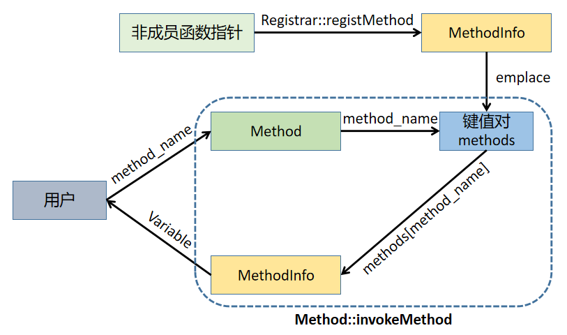
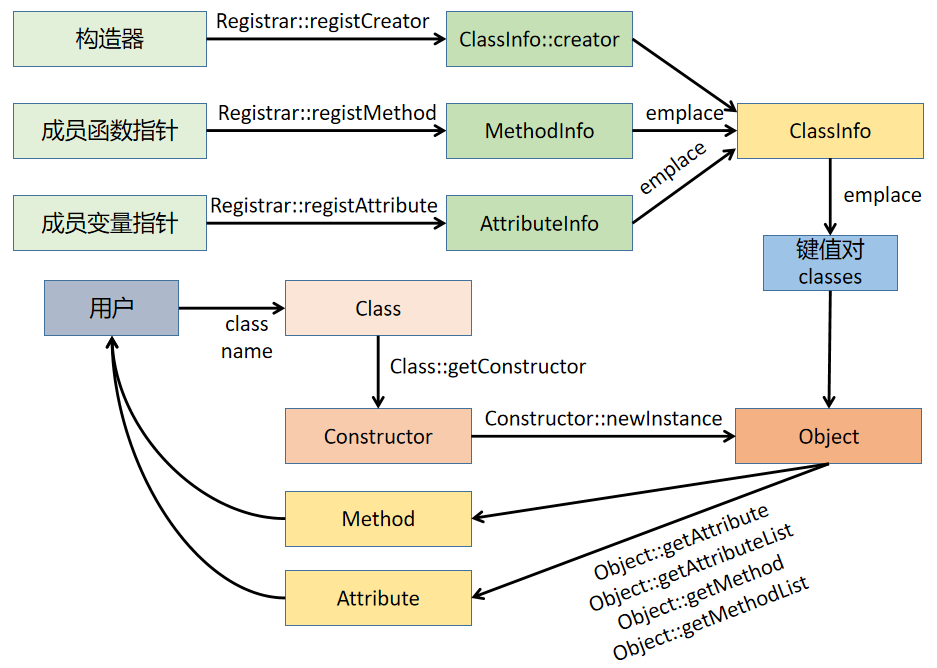

# jrReflection 
实现了对非成员函数、类、类成员变量和类成员函数的反射：上述内容经手动注册后，用户无需使用任何宏即可由名称（字符串）创建并使用。
## 0 基本使用
参见test/main.cpp
## 1 主要思路
### 1.1 非成员函数
将非成员函数的函数指针传入MethodInfo类，其内部使用一个lambda匿名函数包装该函数指针：形式参数不变，但返回值包裹为Variable（Variable为std::any的简单封装，意在抹除类型），以实现通过字符串调用该函数时不依赖于其返回值类型。
### 1.2 类构造器
由于类的构造函数无法取指针，以及在构造期间其内部也可能需要this指针参与，因此无法直接对构造函数进行反射。此处改为对其static工厂方法进行反射。由于static成员函数实际上不依赖于this指针，因此其注册过程的实现于非成员函数一致，但需调用Registrar::registCreator完成注册。  
**注意：出于防止用户误用的目的，Registrar::registCreator不返回任何指向被创建对象的指针，该指针由Object类对象保存，并在类对象析构时自动释放。**
### 1.3 类成员变量
一个类成员变量对应一个get操作和set操作，因此类成员变量所需的信息就是类成员变量名称、get方法和set方法；且为保持类型统一且可控，get和set方法的一个参数就是一个指向Reflectable对象指针。  
**那么如何可以使得用户在通过字符串调取相应类成员变量时不传入具体的类类型信息呢？** 主要思路是在注册类成员变量时，传入类成员变量指针，通过模板获取到类类型信息，并将类类型信息存储在get和set相应的lambda内——在lambda函数体中，对Reflectable对象指针入参进行向下转型(downcast)：  
```c++
T* b = dynamic_cast<T*>(a); // a为Reflectable*
```  
这样的话，类类型信息将保存在lambda中，反射时将无需任何类类型信息。
### 1.4 类成员函数
核心思想与类成员变量一致
## 2 基本数据结构与反射实现
本处所介绍的基本数据结构都定义在src/def.hpp内。  
### 2.1 Variable
Variable是std::any的简单封装，主要用于抹除函数返回值类型。
```c++
class Variable {
private:
    std::any var;   

public:
    /* 将类型为T的值t转换为std::any */
    template<typename T> Variable(T t);
    template<typename T> void toVar(T t);
    /* 将内部存储的std::any还原为类型T的值 */
    template<typename T> T toType();
};

```
### 2.2 非成员函数反射实现
### 2.2.1 MethodInfo
MethodInfo是非成员函数被调用所需要的信息，其内部存储函数名称和被抹去类型的函数对象。
```c++
struct MethodInfo {
    std::string method_name;
    std::any method;
    /* 将函数指针转换为抹除类型的函数对象 */
    template<typename R, typename... Args>
    MethodInfo(const std::string& name, R(*method)(Args...));
};
```
转换过程分为两步：  
1. 抹除函数返回值类型   
在lambda内部调用原本的函数指针，再将返回值转换为Variable。
```c++
std::function<Variable(Args...)> 
method_wrapper = [method](Args&&... args)
{   Variable var;
    var.toVar((*method)(std::forward<Args>(args)...));
    return var;
}
```
2. 抹除函数对象类型  
将函数对象转型为std::any。
```c++
this->method = std::make_any<std::function<Variable(Args...)>>(method_wrapper);
```
### 2.2.2 string-MethodInfo键值对
该键值对定义在reflection.cpp内，对用户透明；用于通过函数名称迅速查找对应的MethodInfo对象。  
```c++
static std::map<std::string, MethodInfo> methods;
```
### 2.3 类反射实现
### 2.3.1 AttrInfo
AttrInfo是调取类成员变量所需的信息，其内部存储变量名称和被抹去类型的getter/setter。  
```c++
struct AttrInfo {
    std::string attr_name;
    std::any set_attr;
    std::any get_attr;
    /* 将类成员指针指针转换为抹除类型的geeter/setter */
    template<typename T, typename Attr>
    AttrInfo(const std::string& name, Attr T::*attr);
};
```
1. 转换为setter  
```c++
std::function<void(Reflectable*, Variable)> 
set_attr_wrapper = [attr](Reflectable* a, Variable var) 
{
    T* b = dynamic_cast<T*>(a); // lambda内部保存了传入的类类型信息
    b->*attr = var.toType<Attr>();
};
// std::make_any
```
2. 转换为getter  
```c++
std::function<Variable(Reflectable*)> 
get_attr_wrapper = [attr](Reflectable* a) 
{
    T* b = reinterpret_cast<T*>(a);  // 保存了类类型信息                                                
    return Variable(b->*attr);
};
// std::make_any
```
### 2.3.2 MemfunInfo
MemfunInfo是调用类成员函数所需的信息，其内部存储函数名称和被抹去类型的函数对象。  
```c++
struct MemfunInfo {
    std::string memfun_name;
    std::any memfun;
    /* 将类成员函数指针转换为抹除类型的函数对象  */
    template<typename T, typename R, typename... Args>
    MemfunInfo(const std::string& name, R(T::*method)(Args...));
};
```
与类成员变量相似，转换的核心在于让lambda自己保存类类型信息：  
```c++
std::function<Variable(Reflectable*, Args...)> 
method_wrapper = [method](Reflectable* a, Args&&... memArgs)
{   
    T* b = dynamic_cast<T*>(a);
    return Variable((b->*method)(std::forward<Args>(memArgs)...));
};
```
### 2.3.3 ClassInfo
ClassInfo是反射一个类所需要的信息，内部保存类名称、抹除类型的类构造器、类成员变量集合与类成员函数集合。
```c++
struct ClassInfo {
    std::string class_name;
    std::any creator;   // 抹除类型的类构造器
    std::map<std::string, AttrInfo> attributes; // 类成员变量集合
    std::map<std::string, MemfunInfo> methods;  // 类成员函数集合
};
```
### 2.3.4 string-ClassInfo键值对
该键值对定义在reflection.cpp内，对用户透明；用于通过类名称迅速查找对应的ClassInfo对象。  
```c++
static std::map<std::string, ClassInfo> objects;
```
## 3 反射工作过程
### 3.1 非成员函数反射

### 3.2 类反射

## 4 测试
运行test/main.cpp后：  

